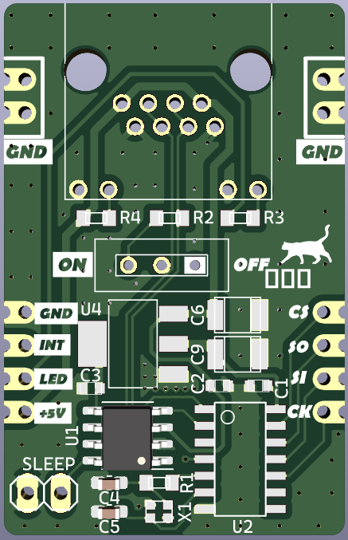
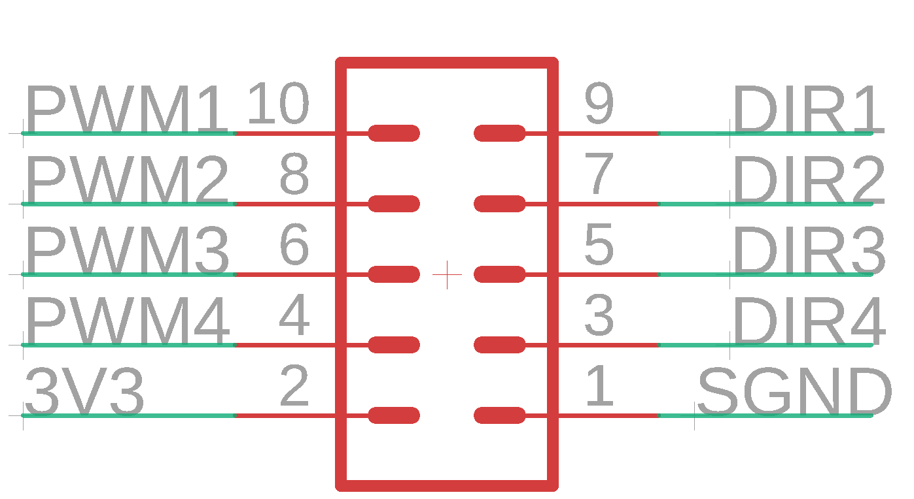

# MDC (Motor Driver Controller) との接続方法について

---

## ひなたとつなげる場合
##### AzusaなどのCAN-FDモジュールとつなげるとき用

#### ON/OFF (重要)
終端抵抗のスイッチです。  
CAN-FDでつなげているモジュールの一番端のモジュールの終端抵抗を必ずONにしましょう。  
(ひなたの場合は基本的にONになるはずです。)

#### SLEEP (重要)
これを短絡させないと動きません。
必ずジャンパーピンを使って短絡させましょう。

#### +5V, GND 
(GNDは5箇所あるが、どこも内部回路でつながっているのでどこに挿しても同様。)  
後述する推奨・非推奨の理由は、マイコンに付随するすべてのモジュールをマイコンの電源供給で済ませる場合、マイコンのGNDが細い部分での異常発熱と、大電流によるレギュレーターへの過剰な負荷を防止するためです。

- LANケーブルかつながっている先(Azusaなど)から給電する場合 **(推奨)**　　
    
    　特につなぐ必要はないが、この場合すべて(マイコン、Azusaなどを含む)のモジュールを同じ電源供給元にする必要がある。(SPI,CAN-FD通信をしている関係上)

- マイコンから給電する場合 **(非推奨)**

    　それぞれ対応する5Vピン、GNDピンをつなげればOK。

#### CS, MISO, MOSI, SCK, INT
マイコン-ひなた間 SPI通信用ピンです。  
CSは信号が来ているかどうかを示す信号、INTは割り込みのピンなのでマイコン側は適当なピン(DigitalOut/InterruptIn)でOKです。
それぞれ対応するピンをつなげればOK。(INTピンは割り込みを設定しているときのみ)

#### LED
LANコネクタの緑色LEDにつながっているピンです。  
つながなくても動きますが、正常/異常かどうかひと目でわかるので、使っておいた方が無難です。

--- 

## PowerUnit, 遠野とつなげる場合
##### MILコネクタ

コネクタに矢印が入っているところが1番ピン、GNDです。

#### 3V3, GND
3V3は3.3Vのところ、GNDはGNDにつなげればOKです。

#### PWM1~4
速度の制御用のピンです。(番号はそれぞれ番号への出力)  
PWMの対応しているピンにつなげればOKです。  
※DriveUnitのモードによってduty比0.5で中立になるかduty比0.0で中立になるか変わるので注意してください。詳しくはGitHub:DriveUnitのページを参照。

#### DIR1~4
回転方向の制御用のピンです。(番号はそれぞれ番号への出力)  
low(0)で正転、high(1)で逆転です。  
回転方向が変わらないとしても、つなげるようにしましょう。  