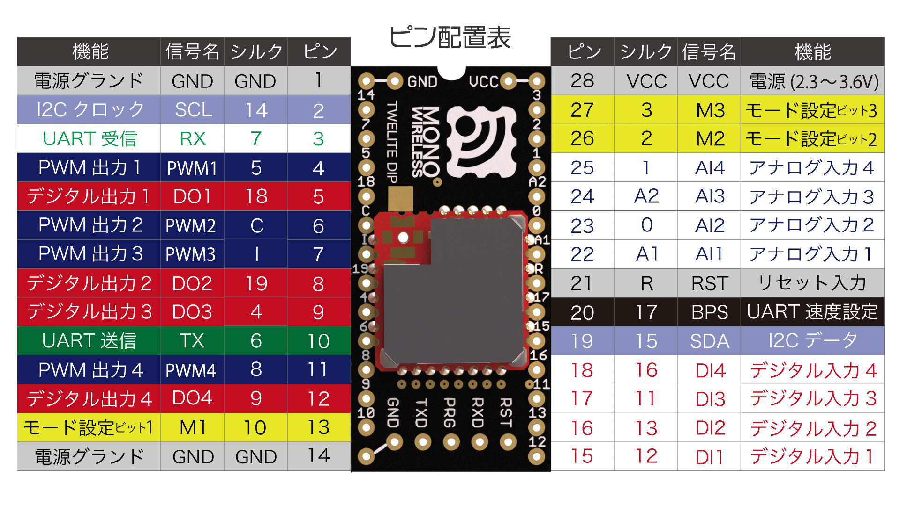
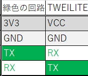

# TWELITE（トワイライト）の使い方について

ロボットを無線で動かすには、なんかしらの方法で通信をする必要がある（はず）

ここでは**超最低限**のTWELITEの使い方についてまとめていく
## TWELITEとは

そもそもTWELITEとは、通信させたいモノとモノにつけることで簡単に通信できるようにしてくれるみたいなイメージ。
歴代の先輩はWi-Fiを使うなどしている事もあるが、それぞれに良さがあるのでどちらでも良い。

## TWELITEの使い方

ではTWELITEの使い方の一例について説明していく。

#### まずは設定から
TWELITEは先ほども述べたように「モノ」と「モノ」を繋げる、つまり2つ（または3つなど）で一組となる。

当たり前だが、TWELITEを2つ用意したら勝手にペアになってくれる！みたいな機能はないので自分でTWEILITEの設定をするべし。

（ここではTera Termを使って説明していく。）
Tera Termはここから（のはず）→https://teratermproject.github.io/

1. ブレッドボード、USB type-A ⇐⇒ mini USB type-Bケーブル、ジャンパ線、緑色の回路を用意する。
2. 緑色の回路とTWEILITEを以下のようにジャンパ線でつなぐ

3. USBケーブルでPCと緑色の回路をつなぎ、Tera Termを起動する。
4. 以下の画像のように設定する
「新しい接続」で「シリアル」を選択する
ここで「シリアル」が選択できない場合、接続がうまくできていないと思われる
.png>)
「設定」から「シリアルポート」を選択
-1.png>)
「スピード」を115200に設定し、他の項目も画像のような値になっていることを確認したら「接続を再設定」をクリック
.png>)
shiftキーを押しながら「+ + +」とキーボード入力して以下のような画面になれば成功
.png>)

「Device ID」を「0」にすると”親”になり、それ以外は”子”になる
「Device ID」以外を同じにすることでペアになるので二つ目も同様に設定するべし。

（M1,M2,M3とGNDを繋いだり繋がなかったりすることで機能が変わるよ）
.png>)