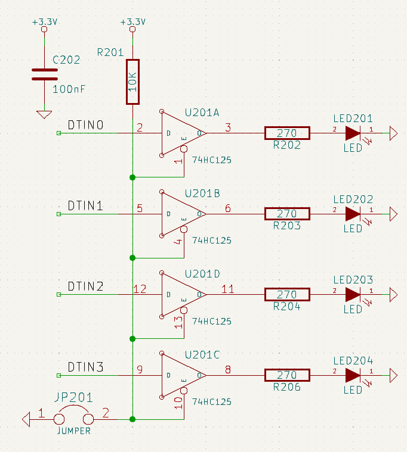
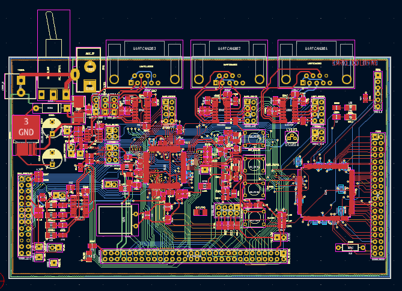
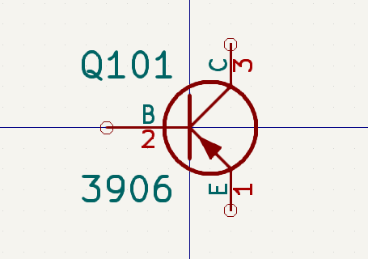
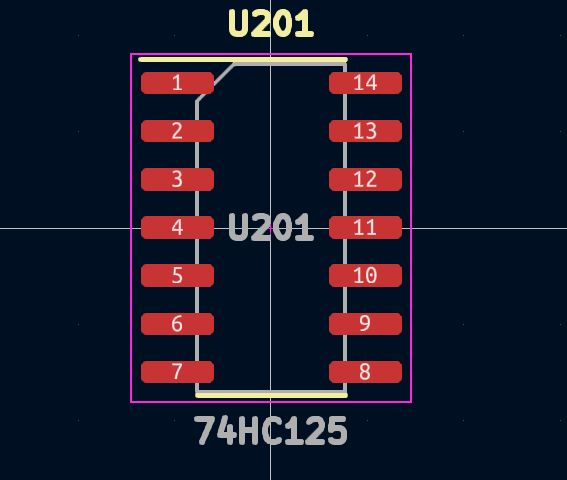

# コンセプト

KiCad を使った回路設計では、回路図を書く作業と基板設計を行う２つの工程があります。

## 回路図

回路図 (Schematic) は回路要素を記号で表した図で、**どの回路素子を使っていて、それぞれがどのように接続されているか**を表しています。

**シンボル**は、回路素子を記号で表したものです。例えば、ジグザグや長方形は抵抗、三角形はオペアンプを表しています。

## 基板設計

基盤 (Circuit Board) 設計では、回路図を描いた後に実際の基板上でどのように部品が配置され、どのように部品同士が接続されるか決めます。

## 各種エディタ

KiCad には、作業の用途別にエディタが用意されています。

- Schematic Editor
  回路図を描くときに使います。
- PCB Editor
  基板設計の際に使います。
- Symbol Editor
  シンボル(部品)を編集するときに使います。

  

- Footprint Editor
  部品のフットプリントを編集するときに編集します。

  

KiCad ではこれらのエディターを用いて回路図作成->基板設計というフローで設計していきます。
