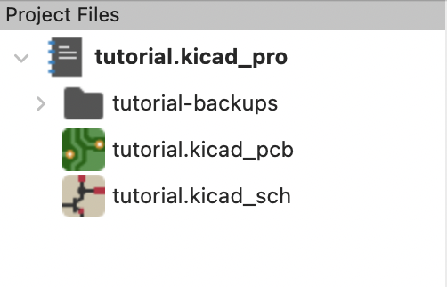

# 新規プロジェクト作成

基板設計を始めるには、まずプロジェクトを作成する必要があります。

[**File**] -> [**New Project**] の順番でクリックし、プロジェクトの保存先とプロジェクト名を入力した後、[**Save**] を押してください。

作成したプロジェクトフォルダーの中に以下のようなファイルができていると思います。

- `.kicad_pro`
  KiCad プロジェクトの拡張子です。
- `.kicad_sch`
  回路図の拡張子です。
- `.kicad_pcb`
  基板設計の拡張子です。

`-backup`フォルダーは数分おきにバックアップが作成されるフォルダーです。

これらのファイルをクリックすることで、用途別のエディターが開きます。
