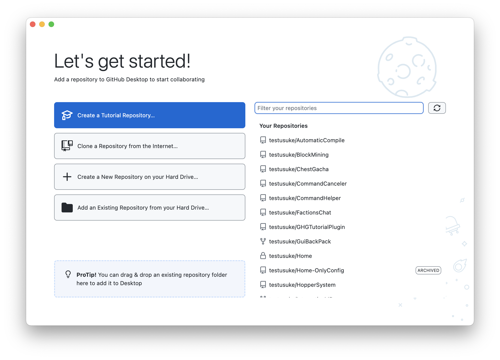
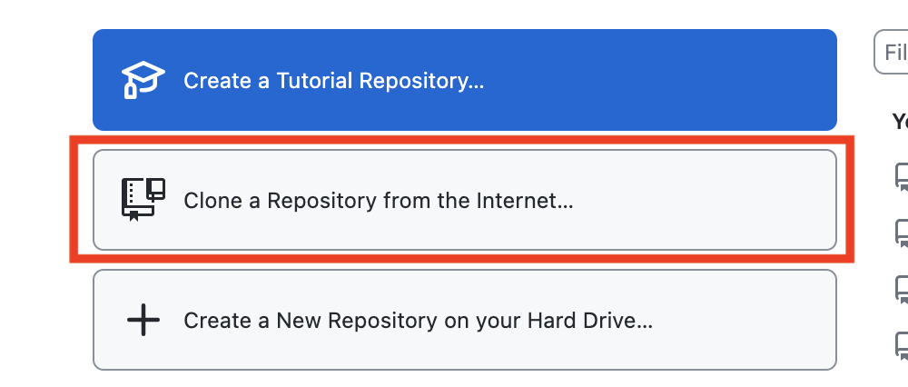
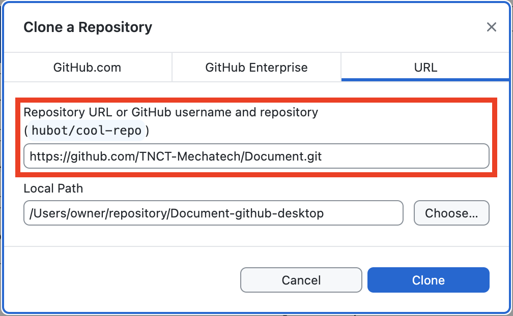
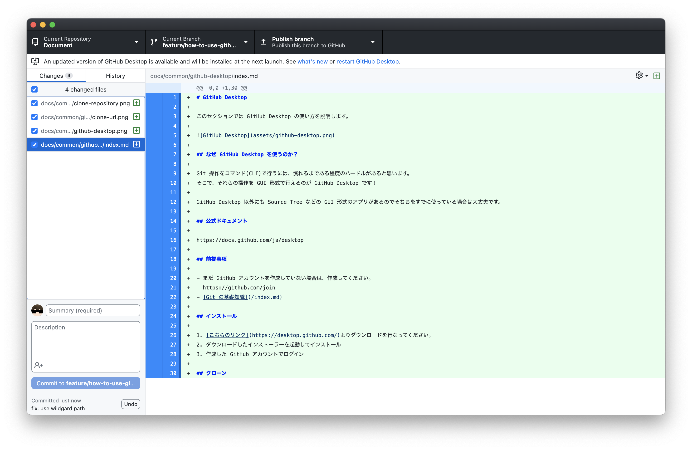
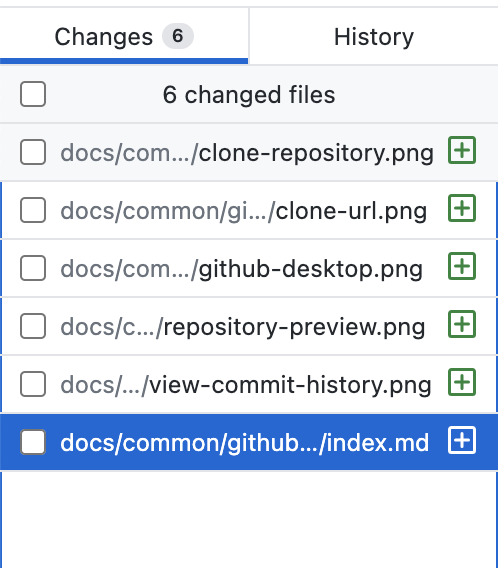
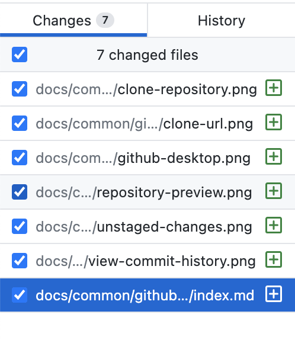
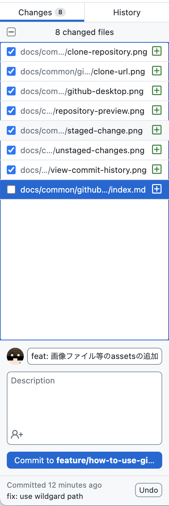
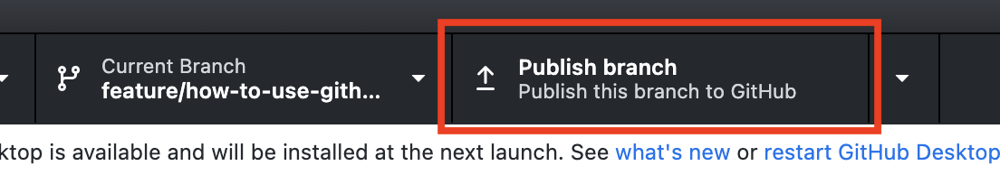
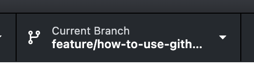

# GitHub Desktop

このセクションでは GitHub Desktop の使い方を説明します。



## なぜ GitHub Desktop を使うのか？

Git 操作をコマンド(CLI)で行うには、慣れるまである程度のハードルがあると思います。  
そこで、それらの操作を GUI 形式で行えるのが GitHub Desktop です！

GitHub Desktop 以外にも Source Tree などの GUI 形式のアプリがあるのでそちらをすでに使っている場合は大丈夫です。

## 公式ドキュメント

https://docs.github.com/ja/desktop

## 前提事項

- まだ GitHub アカウントを作成していない場合は、作成してください。
  https://github.com/join
- [Git の基礎知識](/index.md)

## インストール

1. [こちらのリンク](https://desktop.github.com/)よりダウンロードを行なってください。
2. ダウンロードしたインストーラーを起動してインストール
3. 作成した GitHub アカウントでログイン

## クローン

最初は GitHub に上がっているレポジトリをクローン(clone)する必要があります。

- 最初の画面で「Clone a Repository from the Internet...」を押します。
  
- URL のタブを押して、赤枠で囲った部分にレポジトリの URL を入れて下さい。
  
- (任意)保存先を指定したい場合は「Local Path」の部分を変更して下さい。

クローンが完了すれば下のような画面になります。


## コミット

変更を反映するためにコミット(commit)を行います。
ステージングとコミットの二つの手順があります。

### ステージング

コミットするファイルを登録することをステージングと言います。

左側に写っている「Changes」部分にステージ済み、未ステージのファイルを見ることができます。  
ステージングするファイルにはチェックマークを入れることでステージできます。

未ステージファイル


ステージ済みファイル


### コミット

次にステージングした変更をコミットします。

コミットに適切なコメントを記述して下さい。
どのような変更を加えたかを明確に記述します。

#### 例 1 適切なコメント

あるフォルダー(assets)に画像ファイルを追加した場合

```
feat: 画像ファイル等のassetsの追加
```



### 例 2 適切なコメント

７セグメント LED の処理を Ticker を用いて変更した場合

```
change: 7セグメントLEDの処理をTickerを用いた方法に変更
```

## プッシュ

コミットを GitHub に反映するためにプッシュ(Push)を行います。

上のタブの「Publish Branch」を押すことでプッシュできます。



## ブランチ

ブランチを切り替える方法は「Current Branch」を押して、切り替えたいブランチをブランチを選択してください。


