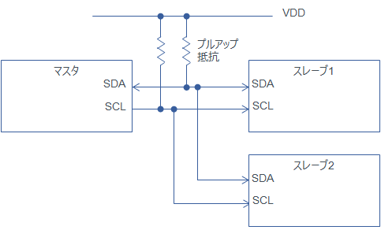
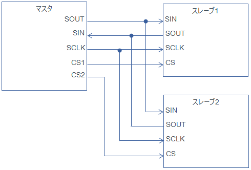
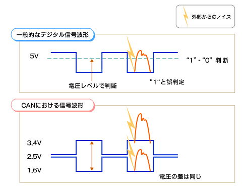
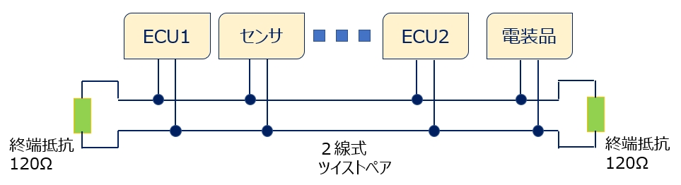

# 通信

## UART (Serial) 通信

UART (Universal Asynchronous Receiver Transmitter) は PC-マイコン間の通信や、1 対 1 のマイコン間通信に用いられることが多いです。  
名前の通り非同期(Asynchronous)通信のため、相手の状態(起動して)に関係なくデータを送ることができます。
言い換えればデータを垂れ流しにしています。

注意点として、同期通信ではないので高速にデータを送れないので注意してください。

## I2C 通信

I2C (Inter-Integrated Circuit) は UART 通信とは違いクロック信号に同期してデータを送受信します。  
マイコン間や IMU センサーとの通信に多用されます。

I2C の特徴の一つに**マスタスレーブ通信**があります。  
マスタがスレーブに対してデータ要求を行い、スレーブは要求があった場合のみマスタにデータを送信します。

図のように、クロック(SCL)とデータ入出力(SDA)の２本の通信線を用いて通信を行います。

注意点として、I2C 通信を行う場合は比較的通信線の長さを短くする必要があります。そのため、基盤内で通信戦を完結させるのが好ましいです。

## SPI 通信

SPI（Serial Peripheral Interface）は I2C と同様にクロック信号に同期してデータを送受信します。

大きな違いとして、チップセレクト(CS)信号線があることです。
これは、どのデバイスと通信を行うか選択する際に必要になる信号線です。デバイスの数だけ CS 信号線が増えます。

## CAN / CAN FD 通信

CAN (Controller Area Network) / CAN FD (CAN with Flexible Data-Rate) はこれまで紹介した通信と大きく異なる部分があります。

1 つ目は、差動通信であることです。差動通信とは２つの信号線の電位差を用いてデータを表現します。  
通信線にノイズが乗った場合を考えます。
1 本の通信線の場合、電圧波形が図の上のように変化してしまい正しくデータを送ることができません。  
2 本の通信線を使った差動通信の場合、両方の通信線にノイズが乗るため２本の通信線の電位差はノイズが乗った場合でも変わりません。

2 つ目は、マルチマスタ方式であることです。それぞれのデバイスがマスタになることができ対等(Pear to Pear)にデータを送受信できます。

